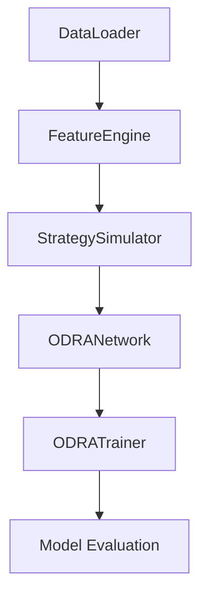
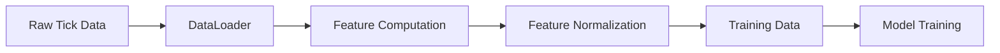
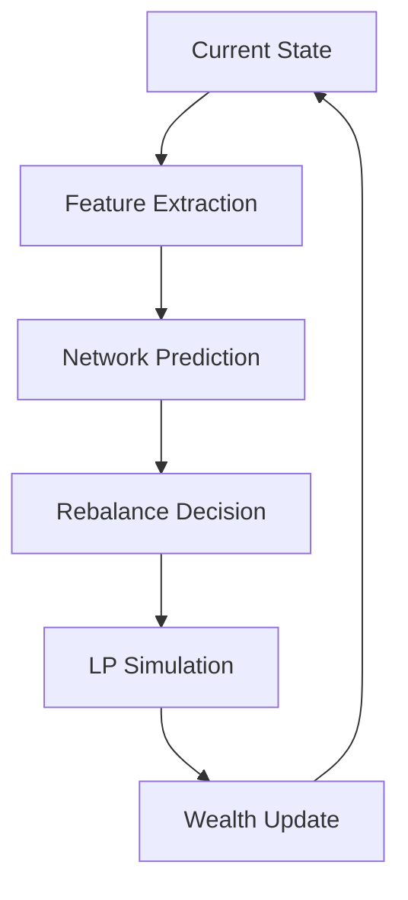

# ODRA Project Structure and Component Connections

## 🌳 Project Tree
```
odra_strategy/
├── config/
│   └── odra_config.yml           # Cấu hình chính cho toàn bộ dự án
│
├── data/
│   ├── raw/                      # Dữ liệu tick-level Uniswap v3 gốc
│   │   └── ticks.csv
│   ├── processed/                # Dữ liệu đã xử lý
│   │   └── odra_dataset.pkl
│   └── utils/
│       ├── __init__.py
│       └── data_loader.py        # DataLoader class
│
├── features/
│   ├── __init__.py
│   ├── extractor.py             # FeatureEngine class
│   └── feature_config.py        # Cấu hình cho feature engineering
│
├── model/
│   ├── __init__.py
│   ├── network.py               # ODRANetwork class (Neural Network)
│   ├── trainer.py              # ODRATrainer class
│   ├── loss.py                 # CARA utility và loss functions
│   └── evaluator.py            # Đánh giá mô hình
│
├── strategy/
│   ├── __init__.py
│   ├── rebalance_logic.py      # Logic rebalancing
│   ├── liquidity_sim.py        # Mô phỏng LP
│   ├── utility.py              # CARA utility calculations
│   └── strategy_simulator.py    # StrategySimulator class
│
├── utils/
│   ├── __init__.py
│   └── logging_utils.py        # Logging configuration
│
├── outputs/
│   ├── models/                 # Lưu trữ mô hình đã train
│   ├── logs/                   # Training logs
│   └── plots/                  # Biểu đồ phân tích
│
└── notebooks/
    └── train_odra_colab.py     # Training pipeline
```

## 🔄 Component Flow và Dependencies

### 1. Training Pipeline Flow


### 2. Data Flow


### 3. Strategy Simulation Flow


## 🔗 Component Connections

### 1. Data Processing Chain
- **DataLoader** (`data/utils/data_loader.py`)
  - Input: Raw tick data từ Uniswap v3
  - Output: DataFrame chuẩn hóa với các trường cần thiết
  - Kết nối với: FeatureEngine

- **FeatureEngine** (`features/extractor.py`)
  - Input: DataFrame từ DataLoader
  - Output: Features đã được tính toán và chuẩn hóa
  - Kết nối với: StrategySimulator

### 2. Strategy Chain
- **StrategySimulator** (`strategy/strategy_simulator.py`)
  - Input: Features từ FeatureEngine
  - Output: Kết quả mô phỏng (wealth, positions)
  - Kết nối với: ODRANetwork, ODRATrainer

- **RebalanceLogic** (`strategy/rebalance_logic.py`)
  - Input: Current state, network predictions
  - Output: Rebalancing decisions
  - Kết nối với: StrategySimulator

### 3. Model Chain
- **ODRANetwork** (`model/network.py`)
  - Input: Processed features
  - Output: Action probabilities
  - Kết nối với: ODRATrainer

- **ODRATrainer** (`model/trainer.py`)
  - Input: Network, training data
  - Output: Trained model
  - Kết nối với: Evaluator

## 📊 Data Types và Interfaces

### 1. Feature Format
```python
features = {
    'ewma_volume': float32,
    'center_bucket': float32,
    'wealth': float32,
    'price': float32,
    't_T': float32,
    'amount0': float32,
    'amount1': float32,
    'sqrtPriceX96': float32,
    'current_tick': float32,
    'liquidity': float32,
    'tick_lower': float32,
    'tick_upper': float32
}
```

### 2. Model Input/Output
```python
# Model Input
input_features = [
    't_T',              # Normalized time
    'ewma_volume',      # EWMA của volume
    'price',           # Current price
    'center_bucket',    # Current center bucket
    'wealth'           # Current wealth
]

# Model Output
output = {
    'action_probs': float32[2 * tau + 2]  # Probability distribution over actions
}
```

### 3. Configuration Interface
```yaml
# odra_config.yml structure
data:
  raw_path: str
  processed_path: str
  
features:
  ewma_alpha: float
  
model:
  hidden_layers: int
  hidden_units: int
  learning_rate: float
  
simulator:
  tau: int
  batch_size: int
```

## 🔧 Utility Functions và Tools

### 1. Logging System
- `logging_utils.py`: Cấu hình logging cho toàn bộ dự án
- Log files được lưu trong `outputs/logs/`
- Training metrics được track và visualize

### 2. Evaluation Tools
- `evaluator.py`: Đánh giá model performance
- Metrics: Wealth evolution, Sharpe ratio, Loss curves
- Visualizations được lưu trong `outputs/plots/`

## 📈 Performance Optimization Points

1. **Data Loading**
   - Parallel processing với ProcessPoolExecutor
   - Batched processing để tối ưu memory

2. **Feature Computation**
   - Vectorized operations với NumPy
   - GPU acceleration cho heavy computations

3. **Training**
   - Mixed precision training (AMP)
   - CUDA optimizations
   - Multi-worker data loading

## 🔍 Testing Points

1. **Unit Tests**
   - Price calculations
   - Feature computation
   - Rebalancing logic

2. **Integration Tests**
   - Data pipeline
   - Training workflow
   - Model evaluation

3. **Performance Tests**
   - Memory usage
   - Training speed
   - GPU utilization 